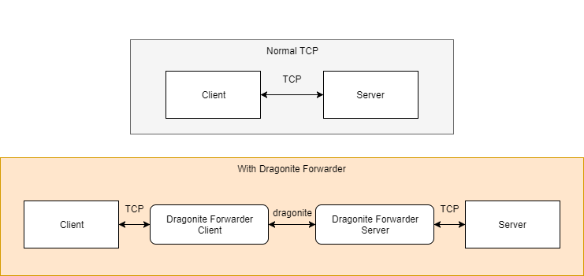

# dragonite-forwarder

A TCP (over Dragonite) relay program that can be used to accelerate any TCP connection between your clients and servers.

    usage: dragonite-forwarder
     -a,--address <address>                     Remote server address for
                                                client / Bind address for
                                                server
     -d,--download-mbps <mbps>                  Download Mbps for client
        --debug                                 Set the logging level to DEBUG
     -f,--forwarding-port <port>                Local port for client /
                                                Forwarding port for server
     -h,--help                                  Help message
     -l,--limit-mbps <mbps>                     Max Mbps per client for server
     -m,--mtu <size>                            MTU of underlying Dragonite
                                                sockets
     -p,--port <port>                           Remote server port for client
                                                / Bind port for server
     -s,--server-mode                           Enable server mode
     -u,--upload-mbps <mbps>                    Upload Mbps for client
     -w,--welcome <msg>                         Welcome message of server
        --web-panel                             Enable Web Panel of underlying
                                                Dragonite sockets (Bind to
                                                loopback interface)
        --web-panel-public                      Enable Web Panel of underlying
                                                Dragonite sockets (Bind to all
                                                interfaces)
        --window-size-multiplier <multiplier>   Send window size multiplier of
                                                underlying Dragonite sockets
                                                (1-10)

## Sample configuration

Assume that we have **a proxy server running on TCP port 8080**, we could use command

    ./dragonite-forwarder -s -f 8080 -l 100 -p 9225

to have it listening on UDP port 9225, limiting the maximum speed of each client to 100 Mbps.

For clients,

    ./dragonite-forwarder -a example.com -p 9225 -f 8080 -d 100 -u 10

will connect to Dragonite Forwarder server at **example.com:9225**, telling the server our maximum download speed is 100 Mbps, upload speed is 10 Mbps. If all goes well, your local TCP port 8080 will now act as TCP port 8080 of that server. Let your local applications connect to the proxy server **localhost:8080** to use the proxy server at **example.com:8080** (and enjoy faster connection speeds)

It is worth noting that the two server options (-l & -p) in this example are completely optional. You can run it without any speed limit or specifying the UDP port (it will use port 5233 by default). See the usage section above for more optional settings.

## Precautions

Dragonite Forwarder has a default MTU (maximum transmission unit, sets an upper bound on the size of UDP packets) of 1300. The receiver's buffer size is also based on the value of this option. If you need to modify this value, make sure that the clients and servers have the same MTU value.

The window size multiplier option is like the "aggressiveness" of the sender. If Dragonite Forwarder is not fully utilizing the bandwidth, try to increase this value step by step.
